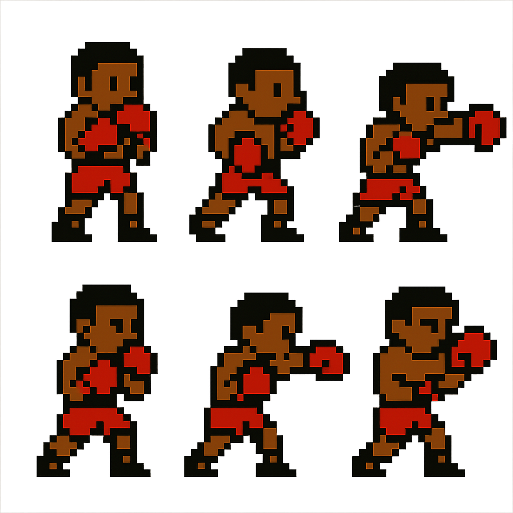

# PixelSlicer

<p align="center">
  
</p>

**PixelSlicer** is a free online tool that helps game developers and pixel artists slice sprite sheets into individual frames. Upload your sprite sheet, specify the grid dimensions, and instantly extract each frame as a separate image.

## ✨ Features

- 🖼️ Upload any sprite sheet image (PNG, JPG, GIF)
- 🔪 Automatically slice into individual frames
- 📏 Configure rows and columns for precise cutting
- 🔍 Preview frames at different zoom levels (1x, 2x, 4x)
- 💾 Download individual frames or all sprites as a ZIP
- 📱 Fully responsive design works on desktop and mobile

## 🚀 Live Demo

Try PixelSlicer now: [https://pixelslicer.app](https://pixelslicer.app)

## 🛠️ Installation

### Prerequisites

- Node.js (v16 or higher)
- npm or yarn

### Setup

1. Clone the repository:

```bash
git clone https://github.com/swoosh1337/pixel-slicer.git
cd pixel-slicer
```

2. Install dependencies:

```bash
npm install
# or
yarn install
```

3. Start the development server:

```bash
npm run dev
# or
yarn dev
```

4. Open your browser and navigate to `http://localhost:8081`

## 🏗️ Building for Production

```bash
npm run build
# or
yarn build
```

The built files will be in the `dist` directory and can be deployed to any static hosting service.

## 🧰 Tech Stack

- **React**: UI library
- **TypeScript**: Type-safe JavaScript
- **Vite**: Fast build tool and dev server
- **Tailwind CSS**: Utility-first CSS framework
- **Framer Motion**: Animation library
- **Shadcn/UI**: Component library

## 📋 How to Use

1. **Upload a Sprite Sheet**: Click the upload button or drag and drop your sprite sheet image
2. **Configure Grid**: Set the number of rows and columns that match your sprite sheet layout
3. **View Extracted Frames**: See all the individual frames extracted from your sprite sheet
4. **Download**: Download individual frames or all sprites as a ZIP file


Contributions are welcome! Please feel free to submit a Pull Request.

1. Fork the repository
2. Create your feature branch (`git checkout -b feature/amazing-feature`)
3. Commit your changes (`git commit -m 'Add some amazing feature'`)
4. Push to the branch (`git push origin feature/amazing-feature`)
5. Open a Pull Request

## 📝 License

This project is licensed under the MIT License - see the [LICENSE](LICENSE) file for details.

## 🙏 Acknowledgements

- [PixelMint](https://pixelmint.com) - For inspiration and support
- All the amazing pixel artists whose work inspired this tool

---


<p align="center">
  <a href="https://github.com/yourusername/pixel-slicer">
    
  </a>
</p>
